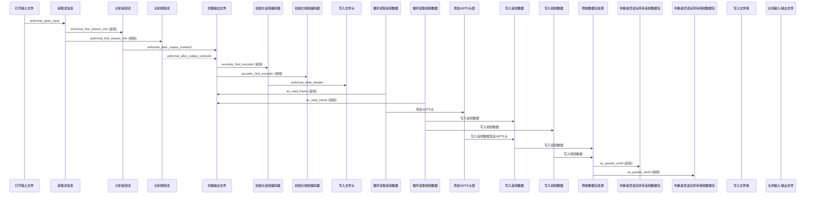
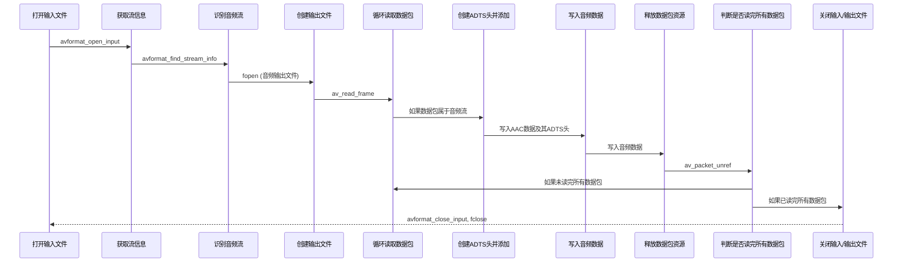

# FF_Mp4Test
在iOS上利用ffmpeg进行mp4混流,分离aac,patch adts

  


## H264 + AAC = MP4

## MP4-> AAC流 + ADTS头 = AAC
```
MP4文件中的音频数据通常以AAC格式存储。为了正确解析和播放AAC音频数据，需要对其进行分离并添加ADTS头。
ADTS（Audio Data Transport Stream）头是AAC音频流的一种头部格式，其中包含关键的音频参数，如采样率、声道配置和帧长度。

分离MP4文件中的AAC音频并添加ADTS头的步骤如下：
1.打开输入文件。
2.获取流信息。
3.识别音频流。
4.创建输出文件。
5.循环读取音频数据包。
6.创建ADTS头并添加到音频数据包。
7.将带有ADTS头的音频数据写入输出文件。
8.释放数据包资源。
9.判断是否读取完所有数据包。
10.关闭输入/输出文件。
```

