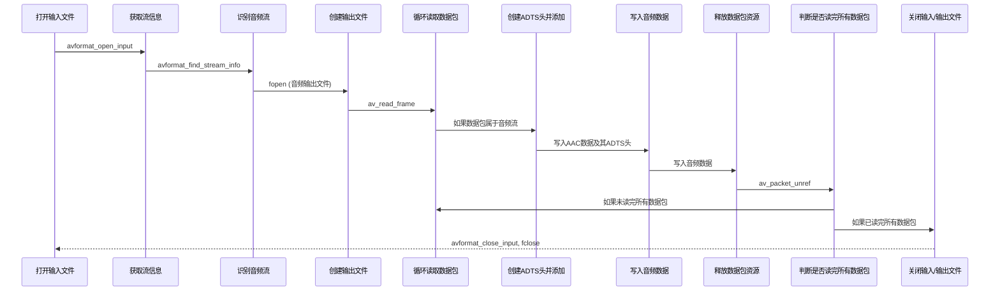

# FF_Mp4Test
在iOS上利用ffmpeg进行mp4混流,分离aac,patch adts

  


## H264 + AAC = MP4

## MP4-> AAC流 + ADTS头 = AAC
```
MP4文件中的音频数据通常以AAC格式存储，并且在没有特殊处理的情况下，无法直接解析和播放。
为了正确地解析和播放AAC音频数据，需要对其进行分离并添加ADTS头。
ADTS（Audio Data Transport Stream）头是一种用于AAC音频流的头部格式。
它包含了关键的音频参数，例如采样率、声道配置和帧长度，这些信息对于解码和播放AAC音频数据非常重要。
```

